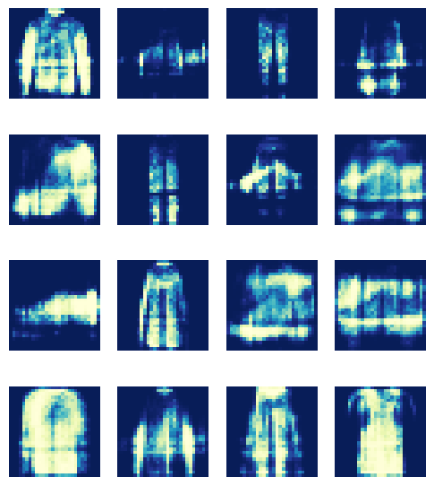

# HW3
В этом домашнем задании вам необходимо имплементировать процедуру обучения WGAN. В качестве датасета предлагается использовать fashion mnist, но вы можете выбрать другой. Необходимые моменты (скачивание датасета, базовая модель GAN, базовый цикл обучения и др.) реализованы в [ноутбке](https://colab.research.google.com/github/AlexeyRogS/cv_course/blob/main/week5/gan_hw.ipynb), который предлагается вам как старт вашей работы. В нем же вы найдете полезные ссылки для решения задачи.

## Описание задания
В качестве шаблона решения используйте [ноутбк](https://colab.research.google.com/github/AlexeyRogS/cv_course/blob/main/week5/gan_hw.ipynb). 

Реализуйте обучение WGAN: 
1. с клиппингом весов
1. с gradient penalty
1. c условной генерацией. 

Опишите полученные результаты, визуализируйте процедуру обучения в виде графиков и результаты в виде изображений.

## WGAN+Clipping 

